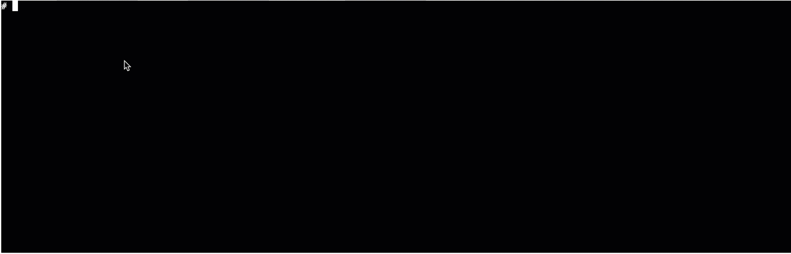

## <center>k8s-webshell<center>

### k8s-webshell 能做什么
用户可以再web页面上直接登录k8s内部容器, 执行shell命令.  
#### 示例如下:


### build

- compile k8s-webshell (要求本地有make): 
    ```bash
    ### 如果需要指定linux版本,加参数 `make linux`
    # make 
    ```
    
- build 镜像(): 
    ```bash
    # make docker 
    ```  


### 部署方式有2种:
- kubernetes 部署(k8s 集群内 incluster 模式)到集群当中
  
- docker-compose 部署(k8s集群外部署) 

### kubernetes 部署 k8s-webshell

进入到doc/deploy/k8s 下面依次执行:
(`注意` 根据自己的pod部署的命名空间修改里面的`namespace`字段)
```bash
# kubectl apply -f k8s-webshell-sa.yaml
# kubectl apply -f k8s-webshell-clusterrole.yaml
# kubectl apply -f k8s-webshell-secret.yaml 
# kubectl apply -f k8s-webshell-clusterrolebinding.yaml
# kubectl apply -f k8s-webshell-deployment.yaml
# kubectl apply -f k8s-webshell-svc.yaml
```
修改`doc/demo/client/index.html` 中的以下内容的ip修改为容器的为域名(ssl证书为xx.com):
```javascript
ws = new WebSocket("wss://xx.com:30001/api/ws?" + "token=" + wsToken);
```
然后打开index.html 就可以测试了

### docker-compose 部署

在项目根目录下执行:
```bash
docker-compose -f docker-compose.yaml up -d k8s-webshell 
```

### 接口使用 
调用`/auth`(POST方法)先获取token,参数如下:
```json
{
	"secretKey":"xxxxx", 
	"paasUser":"zhuruiqing",
	"podNs":"richie",
	"podName":"my-nginx-f9995bdb6-jtr5k",
	"containerName":"my-nginx"
	
}
```
参数说明:
```python
secretKey  api认证secretKey
paasUser   paas平台用户
podNs      pod命名空间
podName    pod名称
containerName 容器名称

```

### web页面调用k8s-webshell websocket接口
调用接口`/api/ws`其中token为 请求auth后获得的token:
`ws = new WebSocket("wss://xx.com:30001/api/ws?" + "token=" + wsToken);`

