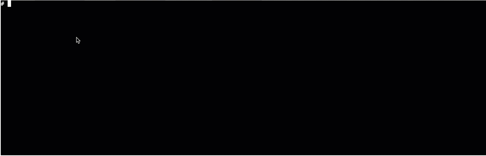

## <center>k8s-webshell<center>

### k8s-webshell 能做什么
用户可以再web页面上直接登录k8s内部容器, 执行shell命令.  
#### 示例如下:


### build

- compile k8s-webshell (需要本地安装docker以及docker-compose):
   ```bash
   # docker-compose -f docker-compose.yaml run --rm go-build
   ```
- build 镜像(根据自己的仓库情况修改docker-compose.yaml中`image`字段)：
    ```bash
    # docker-compose -f docker-compose.yaml build k8s-webshell
    ```  

- push 镜像:
   ```bash
   docker-compose push k8s-webshell
   ```


### 部署方式有2种:
- kubernetes 部署(k8s 集群内 incluster 模式)到集群当中
- docker-compose 部署(k8s集群外部署) 

### kubernetes 部署 k8s-webshell

进入到doc/deploy/k8s 下面依次执行:
(`注意` 根据自己的pod部署的命名空间修改里面的`namespace`字段)
```bash
# kubectl apply -f k8s-webshell-sa.yaml
# kubectl apply -f k8s-webshell-clusterrole.yaml
# kubectl apply -f k8s-webshell-clusterrolebinding.yaml
# kubectl apply -f k8s-webshell-deployment.yaml
# kubectl apply -f k8s-webshell-svc.yaml
```
修改`doc/demo/client/index.html` 中的以下内容的ip修改为容器的nodePort ip:
```javascript
ws = new WebSocket("ws://10.10.152.39:30001/api/ws?" + "podNs=" + podNs + "&podName=" + podName + "&containerName=" + containerName );
```
然后打开index.html 就可以测试了

### docker-compose 部署

在项目根目录下执行:
```bash
docker-compose -f docker-compose.yaml up k8s-webshell -d
```
